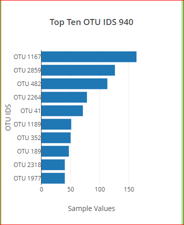

# Belly Button Biodiversity Dashboard
https://umakiyer.github.io/plotly_deployment/

## Overview of the project :
The volunteers should be able to identify the top ten bacterial species found in their navel. If Improbale Beef identifies a species as a candidate to manufacture synthetic beef, the volunteers will be able to identify if that species is found in their navel.

### Horizontal Bar Chart :
The horizontal bar chart was created with sample_values as the values, otu_ids as the labels & the out_labels as the hover text for the bar on the chart. 

### Bubble Chart :
The bubble chart was created with the below parameters: 
* The otu_ids as the x-axis values.
* The sample_values as the y-axis values.
* The sample_values as the marker size.
* The otu_ids as the marker colors.
* The otu_labels as the hover-text values.

 

### Gauge meter:
Gauge chart was created to display the weekly washing frequency values as a measure from 0-10 on the progress bar in the guage chart when an individual ID was selected.

### Customization of the dashboard:
* added an image to the jumbotron
* added a background color to the webpage
* added information about the project as a paragraph.

